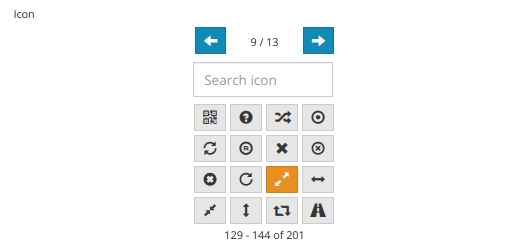
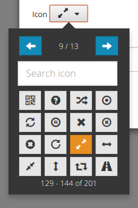
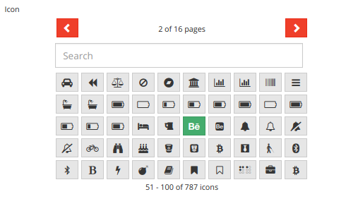

# Autoform Bootstrap IconPicker

This package is a simple wrapper of [Victor's Bootstrap-IconPicker](http://victor-valencia.github.io/bootstrap-iconpicker/) as an [Aldeed's AutoForm](https://github.com/aldeed/meteor-autoform) input type for Meteor.

## Quick Start

1. Install the package:

```
meteor add luixal:autoform-bs-iconpicker
```

2. You can now add the icon picker like any other SimpleSchema field:

```javascript
faIconPicker: {
    type: String,
    label: 'Icon',
    optional: true,
    autoform: {
      type: 'bs-iconpicker'
    }
  },
```

Just with this, icon picker should appear in your autoform with default settings, just like this:




## Options

There are some options added by this package and the base ones hinherited from the original package. The basic option provided by this package is `renderAsButton`, it can be used like this:

```javascript
  faIconPicker: {
    type: String,
    label: 'Icon',
    optional: true,
    autoform: {
      type: 'bs-iconpicker',
      data: {
        renderAsButton: true,
      }
    }
  },
```

You should see something like this:



In addition to this options, you can provide any option from the original package, like in this example:

```javascript
faIconPicker: {
    type: String,
    label: 'Icon',
    optional: true,
    autoform: {
      type: 'bs-iconpicker',
      data: {
        renderAsButton: false, // not needed, it's here just for demo purpouses
        options: {
          arrowClass: 'btn-danger',
          arrowPrevIconClass: 'glyphicon glyphicon-chevron-left',
          arrowNextIconClass: 'glyphicon glyphicon-chevron-right',
          cols: 10,
          footer: true,
          header: true,
          icon: 'fa-bomb',
          iconset: 'fontawesome',
          labelHeader: '{0} of {1} pages',
          labelFooter: '{0} - {1} of {2} icons',
          placement: 'bottom',
          rows: 5,
          search: true,
          searchText: 'Search',
          selectedClass: 'btn-success',
          unselectedClass: 'btn-default'
        }
      }
    }
  },
```

which will render something like this:



A complete list of these options can be found [here, in the original website](http://victor-valencia.github.io/bootstrap-iconpicker/). Or here:

|Name|Type|Default|Description|
|--- |--- |--- |--- |
|align|String|'center'|(Only in div tag) Align of the iconpicker.|
|arrowClass|String|'btn-primary'|Class of the arrows.|
|arrowPrevIconClass|String|'glyphicon glyphicon-arrow-left'|Icon class of the previous arrow.|
|arrowNextIconClass|String|'glyphicon glyphicon-arrow-right'|Icon class of the next arrow.|
|cols|Integer|4|Number of columns to display in the iconpicker. Min value is: 4|
|footer|Boolean|true|Indicates whether to show or hide the footer. true|false|
|header|Boolean|true|Indicates whether to show or hide the header. true|false|
|icon|String|''|Selected icon.|
|iconset|String or Object|'glyphicon'|Selected iconset, can be:  `glyphicon, ionicon, fontawesome, weathericon, mapicon, octicon, typicon|elusiveicon` Or as an object: ```{ iconClass: 'glyphicon', iconClassFix: 'glyphicon-', icons: [ 'play', 'pause' ] }```|
|labelHeader|String|'{0} / {1}'|Header text.|
|labelFooter|String|'{0} - {1} of {2}'|Footer text.|
|placement|String|'bottom'|(Only in button tag) Where the iconpicker will be display. left|top|bottom|right|
|rows|Integer|4|Number of rows to display in the iconpicker. Value 0 indicates all rows.|
|search|Boolean|true|Indicates whether to show or hide the search field. true|false|
|searchText|String|'Search icon'|Text of search field.|
|selectedClass|String|'btn-warning'|Class of the selected icon.|
|unselectedClass|String|'btn-default'|Class of the icons unselected.|

